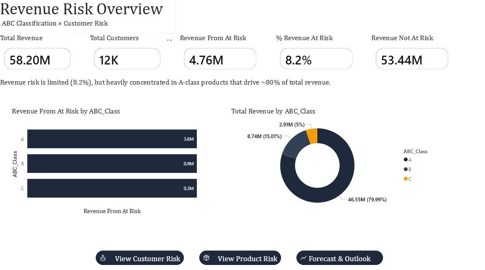

RetailPulse - Revenue Risk & Forecasting Framework
---

Revenue Risk Overview – ABC Concentration & Customer Exposure

Objective
---

Built an end-to-end revenue risk and forecasting framework to quantify exposure, identify concentration risk, and simulate intervention impact.

This project evaluates revenue stability — not just historical performance.

Key Results
---

- **Total Revenue:** 58.2M  
- **Revenue At Risk:** 4.76M (8.2%)  
- **At-Risk Customers:** ~2.1K  
- **A-Class Products At Risk:** 686  
- **Revenue Concentration:** ~80% in A-class products  

Even with only 8.2% exposure, concentration in high-value segments increases financial vulnerability.

What Was Built
---

**Product Risk (ABC Classification)**

* Segmented products by cumulative revenue contribution to detect concentration exposure.

**Customer Risk (RFM Segmentation)**

* Classified customers by recency, frequency, and monetary value to map behavioral risk to financial exposure.

### Revenue Stress Testing

- 25% churn downside scenario  
- 40% recovery intervention scenario  
- Recovery capped at baseline revenue  
- **Worst Case Revenue:** 8.51M  
- **Revenue Preserved via Recovery:** 1.19M

**Time-Series Forecasting**

* Applied SARIMA to capture seasonality and trend components, validating forward revenue stability.

Tech Stack
---

- **SQL** – Fact & dimension modeling  
- **Python** – RFM validation & SARIMA forecasting  
- **Power BI** – Scenario modeling & risk dashboard (DAX)

Business Value
---

* Quantifies revenue exposure

* Identifies high-impact concentration risk

* Enables targeted retention strategy

* Simulates financial downside and recovery

* Integrates statistical forecasting

This project demonstrates structured analytical thinking and end-to-end implementation from data modeling to decision support.
